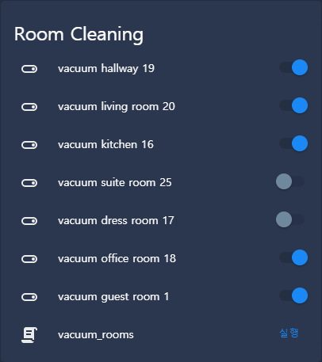

# xiaomi\_vacuum\_rooms
Specific room cleaning with input_booleans.

## Prerequisite

1. Add your vacuum to HA ([doc](https://www.home-assistant.io/integrations/vacuum.xiaomi_miio/)).
2. Retrieving room numbers ([doc](https://www.home-assistant.io/integrations/vacuum.xiaomi_miio/#example-on-how-to-clean-a-specific-room)).
3. Add input\_boolean per room. Make sure the name of input\_boolean is `input_boolean.<room_name>_<room_number>`.

## Example

* configuration.yaml

```yaml
input_boolean:
  vacuum_hallway_19:
  vacuum_living_room_20:
  vacuum_kitchen_16:
  vacuum_suite_room_25:
  vacuum_dress_room_17:
  vacuum_office_room_18:
  vacuum_guest_room_1:

script:
  vacuum_rooms:
    sequence:
      - service: python_script.xiaomi_vacuum_rooms
        data:
          entity_id: vacuum.xiaomi_vacuum_cleaner
          rooms:
            - input_boolean.vacuum_hallway_19
            - input_boolean.vacuum_living_room_20
            - input_boolean.vacuum_kitchen_16
            - input_boolean.vacuum_suite_room_25
            - input_boolean.vacuum_dress_room_17
            - input_boolean.vacuum_office_room_18
            - input_boolean.vacuum_guest_room_1
```

* Lovelace

